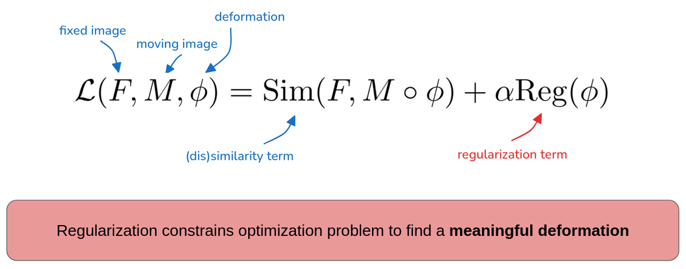

# Regularization in medical image registration

This repo lists available **code resources** for different regularization techniques applied in medical image registration.
See our paper for
- a comprehensive overview of regularization methods in conventional and learning-based registration, 
- research gaps, 
- open challenges in the field, and
- future directions.

🕮 **From Model Based to Learned Regularization in Medical Image Registration: A Comprehensive Review** (Reithmeir et al., 2025, in review). Available on [arXiv](https://arxiv.org/abs/2412.15740).

Feel free to contact me if you think there is something missing or you want to collaborate!

***
## ✨ Model-based regularization ✨
applies a model on the deformation that is
 - global,
 - user-defined, and
 - based on prior assumptions.

### ➡️ Some modular code bases with model-based methods:
- Autograd Image Registration Laboratory: [https://github.com/airlab-unibas/airlab](https://github.com/airlab-unibas/airlab)
  - Isotropic total variation, anisotropic total variation, diffusion
- MONAI :[https://docs.monai.io/en/stable/losses.html#registration-losses](https://docs.monai.io/en/stable/losses.html#registration-losses)
  - Bending energy, diffusion
- FAIR: Flexible Algorithms for Image Registration :[https://github.com/C4IR/FAIR.m](https://github.com/C4IR/FAIR.m)
  - curvature, linear elastic, hyper-elastic

### ➡️ global smoothness
- diff-VoxelMorph (Dalca et al., 2019): [https://github.com/voxelmorph/voxelmorph](https://github.com/voxelmorph/voxelmorph)
- Learning Diffeomorphic and Modality-invariant Registration using B-splines (Qiu et al., MIDL 2021): [https://github.com/qiuhuaqi/midir](https://github.com/qiuhuaqi/midir)

### ➡️ local discontinuities
- Isotropic total variation regularization of displacements in parametric image registration (Vishnevskiy et al., 2017): [https://github.com/visva89/pTVreg](https://github.com/visva89/pTVreg)

### ➡️ inverse consistency and cycle consistency
- ICON (Greer et al., 2021): [https://github.com/uncbiag/ICON](https://github.com/uncbiag/ICON)
- GradICON (Tian et al., 2023): [https://github.com/uncbiag/ICON](https://github.com/uncbiag/ICON)
- Cycle-consistent implicit neural representations (van Harten et al., 2014): [https://github.com/Louisvh/cycle_consistent_INR](https://github.com/Louisvh/cycle_consistent_INR)
-  CycleMorph (Kim et al., 2019): [https://github.com/boahK/MEDIA_CycleMorph](https://github.com/boahK/MEDIA_CycleMorph)
- A coarse-to-fine deformable transformation framework for unsupervised multi-contrast MR image registration with dual consistency constraint (Huang et al., 2020): [https://github.com/SZUHvern/TMI_multi-contrast-registration](https://github.com/SZUHvern/TMI_multi-contrast-registration)
- SITReg (Honkamaa et al., 2024): [https://github.com/honkamj/SITReg](https://github.com/honkamj/SITReg)
- Towards Saner Deep Image Registration (Duan et al., 2023): [https://github.com/tuffr5/Saner-deep-registration](https://github.com/tuffr5/Saner-deep-registration)
### ➡️ local invertibility
- Fast symmetric diffeomorphic image registration with convolutional neural networks (Mok, Chung 2020): [https://github.com/cwmok/Fast-Symmetric-Diffeomorphic-Image-Registration-with-Convolutional-Neural-Networks](https://github.com/cwmok/Fast-Symmetric-Diffeomorphic-Image-Registration-with-Convolutional-Neural-Networks)
- Towards Positive Jacobian: Learn to Postprocess Diffeomorphic Image Registration with Matrix Exponential (Pal et al. 2022): [https://github.com/Soumyadeep-Pal/Diffeomorphic-Image-Registration-Postprocess](https://github.com/Soumyadeep-Pal/Diffeomorphic-Image-Registration-Postprocess)
- SPNet (Zhang et al., 2023): [https://github.com/zhangliutong/SPnet](https://github.com/zhangliutong/SPnet)

### ➡️ volume preservation

### ➡️ diffeomorphisms
- LapIRN (mok et al. 2019): [https://github.com/cwmok/LapIRN](https://github.com/cwmok/LapIRN)
- VoxelMorph (Balakrishnan et al. 2019):  [https://github.com/voxelmorph/voxelmorph](https://github.com/voxelmorph/voxelmorph)
- Learning Diffeomorphism for Image Registration with Time-Continuous Networks using Semigroup Regularization (Matinkia, 2024): [https://github.com/mattkia/SGDIR/](https://github.com/mattkia/SGDIR/)
- Diffeomorphic Image Registration Using Lipschitz Continuous Residual Networks (Joshi et al., 2022): [Diffeomorphic Image Registration Using Lipschitz Continuous Residual Networks.](Diffeomorphic Image Registration Using Lipschitz Continuous Residual Networks.)
- Networks for Joint Affine and Non-Parametric Image Registration (Shen et al., 2015): [https://github.com/uncbiag/easyreg](https://github.com/uncbiag/easyreg)
- 

### ➡️ physics-inspired properties
- Non-rigid Medical Image Registration using Physics-informed Neural Networks (min et al., 2023): [https://github.com/ZheMin-1992/Registration_PINNs](https://github.com/ZheMin-1992/Registration_PINNs)
- WarpPINN: Cine-MR image registration with physics-informed neural networks (Arratia Lopez et al., 2023):[https://github.com/fsahli/WarpPINN](https://github.com/fsahli/WarpPINN)
- Biomechanics-Informed Non-rigid Medical Image Registration and its Inverse Material Property Estimation with Linear and Nonlinear Elasticity (Min et al., 2024): [https://github.com/ZheMin-1992/Registration_PINNs](https://github.com/ZheMin-1992/Registration_PINNs)

***
## ✨ Problem-specific regularization ✨
is 
- tailored towards the data by 
- taking additional data knowledge into account, that is
- often spatially-adaptive.

### ➡️ multi-structure registration
- Context-driven Pyramid Registration Network for Estimating Large Topology-preserved Deformation (Wang et al., 2023): [https://github.com/MedicalReg/CPRNet-main](https://github.com/MedicalReg/CPRNet-main)
- SequenceMorph: A Unified Unsupervised Learning Framework for Motion Tracking on Cardiac Image Sequences (Ye et al., 2023): [https://github.com/DeepTag/SequenceMorph](https://github.com/DeepTag/SequenceMorph)
- Recurrent Tissue-Aware Network for Deformable Registration of Infant Brain MR Images (wei et al., 2022): [https://github.com/Barnonewdm/RTA-Net](https://github.com/Barnonewdm/RTA-Net)
- A Deep Discontinuity-Preserving Image Registration Network (chen et al., 2021): [https://github.com/ccmim/DDIR](https://github.com/ccmim/DDIR)

### ➡️ images with topology changes
- **missing regions**
  - Preserving Tumor Volumes for Unsupervised Medical Image Registration (Dong et al., 2023): [https://dddraxxx.github.io/Volume-Preserving-Registration/](https://dddraxxx.github.io/Volume-Preserving-Registration/)
  - Weighted Metamorphosis for Registration of Images with Different Topologies (Francois et al., 2022): [https://github.com/antonfrancois/Demeter_metamorphosis.](https://github.com/antonfrancois/Demeter_metamorphosis.)
- **shrinking/growing regions**
  - TopAwaRe: Topology-Aware Registration (Nielsen et al., 2019): [https://github.com/RuneKokNielsen/TopAwaRe](https://github.com/RuneKokNielsen/TopAwaRe)
  - Spot the Difference: Detection of Topological Changes via Geometric Alignment (Czolbe et al., 2021): [https://github.com/SteffenCzolbe/TopologicalChangeDetection](https://github.com/SteffenCzolbe/TopologicalChangeDetection)
  - Co-Learning Semantic-aware Unsupervised Segmentation for Pathological Image Registration (Liu et al., 2023): [https://github.com/brain-intelligence-lab/GIRNet](https://github.com/brain-intelligence-lab/GIRNet)
  - Unsupervised Deformable Image Registration with Absent Correspondences in Pre-operative and Post-Recurrence Brain Tumor MRI Scans (Mok et al., 2022): [https://github.com/cwmok/DIRAC](https://github.com/cwmok/DIRAC)

### ➡️ organ-specific motion

- **sliding motion**
  - Directional averages for motion segmentation in discontinuity preserving image registration (Jud et al., 2017): [https://github.com/ChristophJud/DAMSRegistration](https://github.com/ChristophJud/DAMSRegistration)
  - Bilateral regularization in reproducing kernel hilbert spaces for discontinuity preserving image registration (jud et al., 2016): [https://github.com/ChristophJud/SKMImageRegistration.git](https://github.com/ChristophJud/SKMImageRegistration.git)
  - Edge- and detail-preserving sparse image representations for deformable registration of chest MRI and CT volumes (Heinrich et al., 203): [https://github.com/multimodallearning/slic_reg](https://github.com/multimodallearning/slic_reg)
  - Sparse kernel machines for discontinuous registration and nonstationary regularization (jud et al., 2016): [https://github.com/ChristophJud/SKMImageRegistration](https://github.com/ChristophJud/SKMImageRegistration)
  - Arbitrary Order Total Variation (AOTV) for Deformable Image Registration (Duan et al., 2023): [https://github.com/j-duan/AOTV](https://github.com/j-duan/AOTV)

- **cyclic motion**
  - SequenceMorph: A Unified Unsupervised Learning Framework for Motion Tracking on Cardiac Image Sequences (Ye et al., 2023): [https://github.com/DeepTag/SequenceMorph](https://github.com/DeepTag/SequenceMorph)
  - Cardiac motion estimation from medical images: a regularisation framework applied on pairwise image registration displacement fields (Wiputra et al., 2020): [https://github.com/WeiXuanChan/motionSegmentation](https://github.com/WeiXuanChan/motionSegmentation)
  
***
## ✨ learned regularization ✨
- uses ML/DL models to 
- learn spatially-adaptive deformation properties 
- from a training dataset.

### ➡️ learned local smoothness properties

### ➡️ learned feasible deformation spaces

### ➡️ test time adaptive regularization

conditional global L2 regularization
- HyperMorph (Hoopes et al. 2021):  [https://github.com/voxelmorph/voxelmorph](https://github.com/voxelmorph/voxelmorph)
- conditional LapIRN (Mok et al. 2021): [https://github.com/cwmok/Conditional_LapIRN](https://github.com/cwmok/Conditional_LapIRN)
***