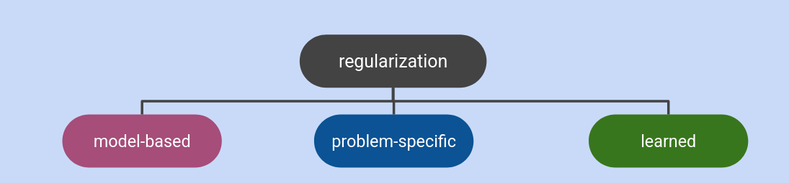
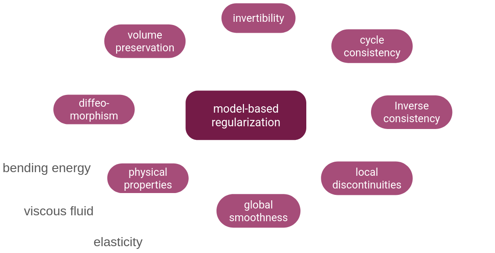
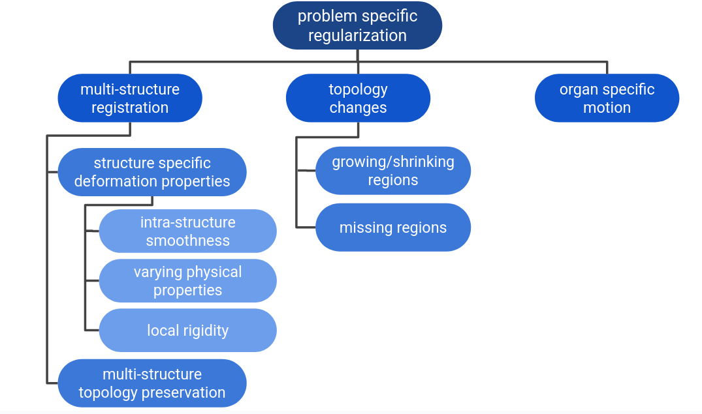
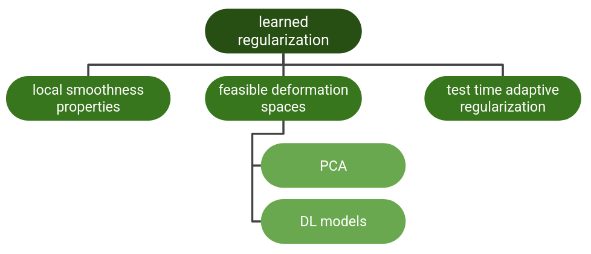

# Regularization in medical image registration
This repo lists available code resources for different regularization techniques applied in medical image registration.
For more information see the paper:

🕮 **From Model Based to Learned Regularization in Medical Image Registration: A Comprehensive Review** (Reithmeir et al., 2025, in review). Available on [arXiv](https://arxiv.org/abs/2412.15740).

Feel free to contact me if you think there is something missing or you want to collaborate!

***

## ✨ Model-based regularization ✨
 Model-based regularization applies a global, user-defined model on the deformation. 

### ➡️ Some modular code bases with model-based methods:
- Autograd Image Registration Laboratory: [https://github.com/airlab-unibas/airlab](https://github.com/airlab-unibas/airlab)
  - Isotropic total variation, anisotropic total variation, diffusion
- MONAI :[https://docs.monai.io/en/stable/losses.html#registration-losses](https://docs.monai.io/en/stable/losses.html#registration-losses)
  - Bending energy, diffusion
- FAIR: Flexible Algorithms for Image Registration :[https://github.com/C4IR/FAIR.m](https://github.com/C4IR/FAIR.m)
  - curvature, linear elastic, hyper-elastic

### ➡️ global smoothness
- diff-VoxelMorph (Dalca et al., 2019): [https://github.com/voxelmorph/voxelmorph](https://github.com/voxelmorph/voxelmorph)
- Learning Diffeomorphic and Modality-invariant Registration using B-splines (Qiu et al., MIDL 2021): [https://github.com/qiuhuaqi/midir](https://github.com/qiuhuaqi/midir)

### ➡️ local discontinuities
- Isotropic total variation regularization of displacements in parametric image registration (Vishnevskiy et al., 2017): [https://github.com/visva89/pTVreg](https://github.com/visva89/pTVreg)

### ➡️ inverse consistency and cycle consistency
- ICON (Greer et al., 2021): [https://github.com/uncbiag/ICON](https://github.com/uncbiag/ICON)
- GradICON (Tian et al., 2023): [https://github.com/uncbiag/ICON](https://github.com/uncbiag/ICON)
- Cycle-consistent implicit neural representations (van Harten et al., 2014): [https://github.com/Louisvh/cycle_consistent_INR](https://github.com/Louisvh/cycle_consistent_INR)
-  CycleMorph (Kim et al., 2019): [https://github.com/boahK/MEDIA_CycleMorph](https://github.com/boahK/MEDIA_CycleMorph)
- A coarse-to-fine deformable transformation framework for unsupervised multi-contrast MR image registration with dual consistency constraint (Huang et al., 2020): [https://github.com/SZUHvern/TMI_multi-contrast-registration](https://github.com/SZUHvern/TMI_multi-contrast-registration)
- SITReg (Honkamaa et al., 2024): [https://github.com/honkamj/SITReg](https://github.com/honkamj/SITReg)
- Towards Saner Deep Image Registration (Duan et al., 2023): [https://github.com/tuffr5/Saner-deep-registration](https://github.com/tuffr5/Saner-deep-registration)
### ➡️ local invertibility
- Fast symmetric diffeomorphic image registration with convolutional neural networks (Mok, Chung 2020): [https://github.com/cwmok/Fast-Symmetric-Diffeomorphic-Image-Registration-with-Convolutional-Neural-Networks](https://github.com/cwmok/Fast-Symmetric-Diffeomorphic-Image-Registration-with-Convolutional-Neural-Networks)
- Towards Positive Jacobian: Learn to Postprocess Diffeomorphic Image Registration with Matrix Exponential (Pal et al. 2022): [https://github.com/Soumyadeep-Pal/Diffeomorphic-Image-Registration-Postprocess](https://github.com/Soumyadeep-Pal/Diffeomorphic-Image-Registration-Postprocess)
- SPNet (Zhang et al., 2023): [https://github.com/zhangliutong/SPnet](https://github.com/zhangliutong/SPnet)

### ➡️ volume preservation

### ➡️ diffeomorphisms
- LapIRN (mok et al. 2019): [https://github.com/cwmok/LapIRN](https://github.com/cwmok/LapIRN)
VoxelMorph (Balakrishnan et al. 2019):  [https://github.com/voxelmorph/voxelmorph](https://github.com/voxelmorph/voxelmorph)

### ➡️ physics-inspired properties

***

## ✨ Problem-specific regularization ✨
ℹProblem-specific regularization is tailored towards the data by taking additional data knowledge into account. It is often spatially-adaptive.

### ➡️ multi-structure registration

### ➡️ images with topology changes
- **missing regions**
- **shrinking/growing regions**

### ➡️ organ-specific motion

- **sliding motion**
- **cyclic motion**
***

## ✨ learned regularization ✨
ℹ️ Learned regularization uses ML/DL models to learn spatially-adaptive deformation properties from a training dataset.

### ➡️ learned local smoothness properties

### ➡️ learned feasible deformation spaces

### ➡️ test time adaptive regularization

conditional global L2 regularization
- HyperMorph (Hoopes et al. 2021):  [https://github.com/voxelmorph/voxelmorph](https://github.com/voxelmorph/voxelmorph)
- conditional LapIRN (Mok et al. 2021): [https://github.com/cwmok/Conditional_LapIRN](https://github.com/cwmok/Conditional_LapIRN)
***